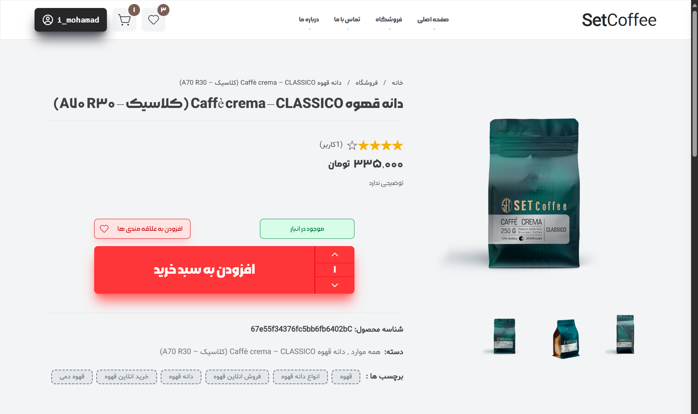

<h1 align="center">
  <br>
  <a href="https://github.com/Mohamadshiravi/set-coffee.git"></a>
</h1>

<h4 align="center">A full-Stack Website for selling coffee with user panel & admin panel</h4>

<p align="center">

  <a href="http://nextjs.org">
    
    
  </a>

</p>

<br/>

### Features:

- **Authentication with SMS**
- **Uploads photo on Cloud**
- **Add-remove-Edit Product**
- **user Authentication with no external pakage**
- **send tiket to admin panel**
- **send message to admin panel**
- **Add comments and rating for Products**
- **Add discount to product**
- **Add Product To Favorite**
- **filter product by price,star,newest,oldest,price-range**
- **Cart!**
- **Full Admin Panel**
- **Full User Panel**

<h1 align="center">
  <a href="https://github.com/Mohamadshiravi/set-coffee.git"></a>
</h1>

Live on [https://set-coffee-eight.vercel.app/](https://set-coffee-eight.vercel.app/)
<br />
admin panel [https://set-coffee-eight.vercel.app/p-admin](https://set-coffee-eight.vercel.app/p-admin)

### Admin Panel : (login with this phone and you are admin !):

```bash
phone : 09011468142
```

<h1 align="center">
  <a href="https://github.com/Mohamadshiravi/set-coffee.git"></a>
</h1>

## Run Project on local

**Note:**

> !!! You need MongoDB for Run Project

add This environment variables to run project :

```bash
TOKEN_KEY : randomString
MONGODB_URI : your mongodb connection string

SMS_PANEL_PASS : 'your faraz SmS account password
SMS_PANEL_USERNAME : 'your faraz SmS account username
SMS_PANEL_PATTERN : 'your faraz SmS pattern

NEXT_PUBLIC_PUBLIC_KEY= 'get it form Imagekit'
CLOUD_PRIVATE_KEY='get it form Imagekit'
NEXT_PUBLIC_URL_ENDPOINT='get it form Imagekit'
```

And, You Need build Project By :

```bash
npm run build
# or
yarn build
# or
pnpm build
```

Next Run with :

```bash
npm run start
# or
yarn start
# or
pnpm start
```

Open [http://localhost:3000](http://localhost:3000) with your browser to see the project
